# CTFs-Solution-Documented-

This repo is aimed to document CTF challenges that i solved.

I use it mainly for HTB practice labs and anything close to CTF work. The idea is simple: screenshot what i did, write the steps in normal words, and keep proof that i actually practiced it.

This is not a perfect professional report. It is my notes while solving and learning.

Some screenshots may show lab IPs, fake domains, usernames, or lab passwords. They are from the practice environment and not real personal secrets.

## HTB Practice Labs - 2026-09-19

The screenshots were mixed together, so i split them into two parts:

- Lab 1: Networking / EastWest web, DNS, mail and SSL checking
- Lab 2: Security log hunting with Splunk / Elastic

I did not add the old AD screenshots from the folder because they belong to the sysadmin lab, not this repo.

---

## Lab 1 - Networking / EastWest web, DNS and mail notes

This one was more about checking the target setup and documenting what i saw. I looked at the network shape, browsed the EastWest site, checked the contact form, then checked mail/DNS/SSL related pages.

### 1. Basic network lab architecture

Starting point for the networking lab. FortiGate, a switch, the server VM, PC1 and VPCS are connected together. I kept this first because without the topology the rest is just random browser screenshots.

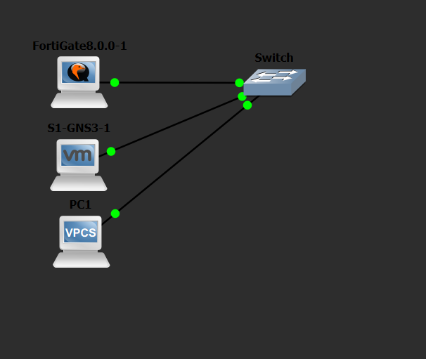

### 2. First DNS fail / bad hostname test

I tried opening a weird encoded host name and it failed with `DNS_PROBE_FINISHED_NXDOMAIN`. This was a small reminder to check the exact hostname before wasting time on the wrong target.

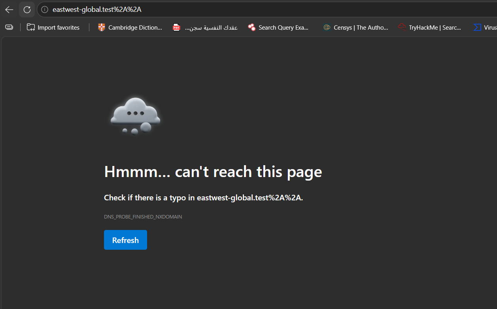

### 3. About page

The target site loaded as EastWest Global Business Solutions. I started by reading the about page to understand what public information the site gives away.

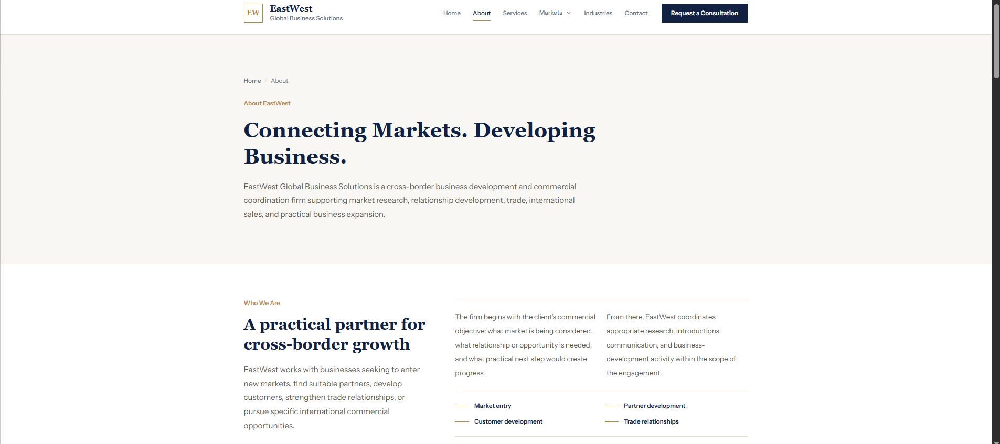

### 4. Capabilities section

Here i checked what services/capabilities the site lists. Good habit before doing anything deeper, because sometimes the content hints at tech stack, business area, or useful words for later searches.

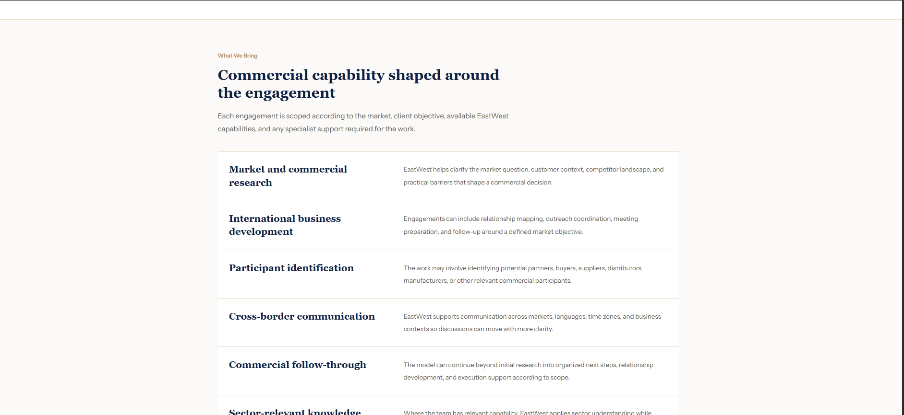

### 5. Approach section

More normal browsing. I was mapping the site pages and sections, not exploiting anything yet.

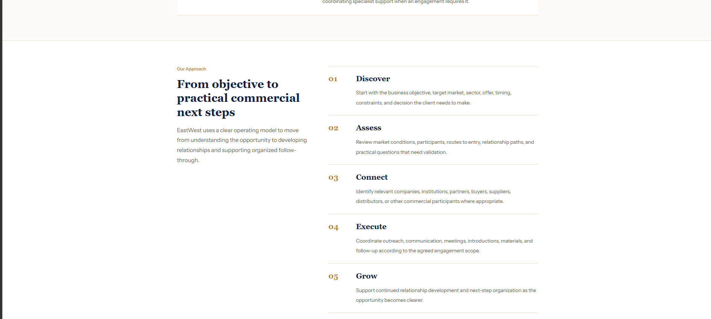

### 6. Team and capabilities section

Checked the team/capability text. It mentions technology and digital implementation, plus languages. I only wrote it down as public OSINT from the site.

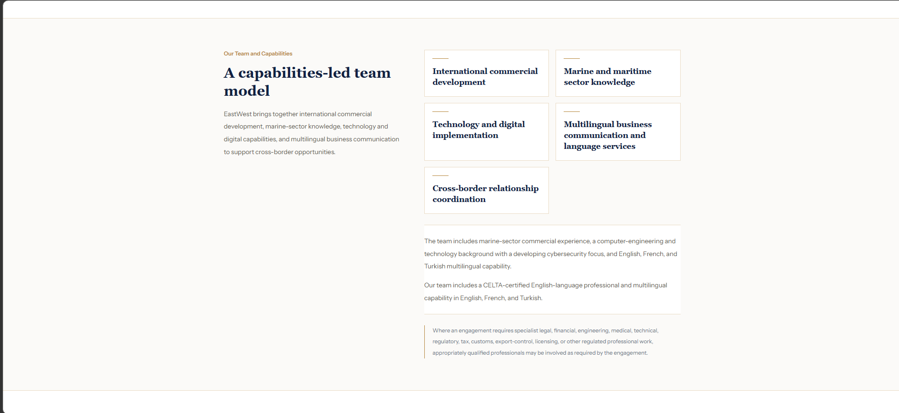

### 7. Corridors and engagement section

This page showed the priority corridors and business engagement steps. Again, this was just content mapping and seeing what areas the site exposes.

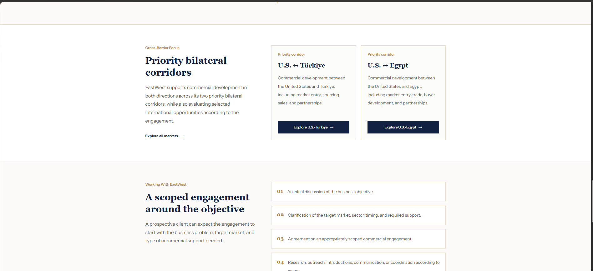

### 8. Footer and CTA

Reached the bottom of the page and checked footer links. Footer is useful because it normally confirms the main navigation and contact info.

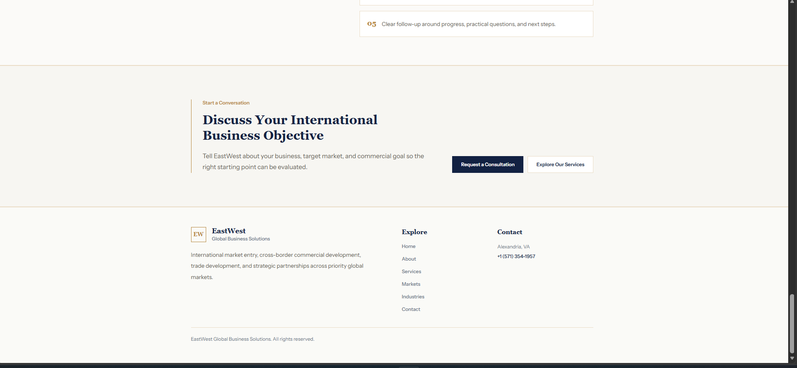

### 9. Contact page start

Opened the contact page. I noted the wording and the fact that the form is the main written contact method.

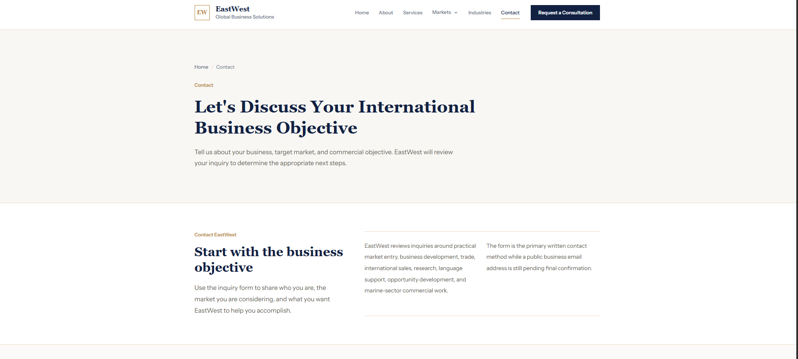

### 10. Contact form

The contact form had required fields like full name, work email, inquiry type, and message. I checked the fields because forms are always worth documenting in web labs.

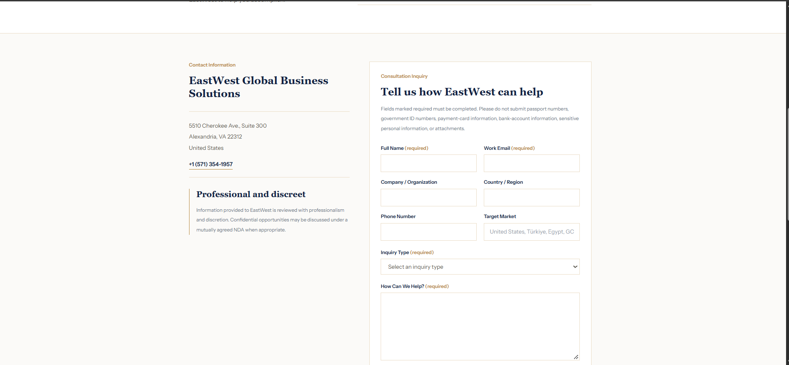

### 11. After inquiry section

The page explains what happens after sending an inquiry. Nothing special, but i kept it because it completes the contact page walkthrough.

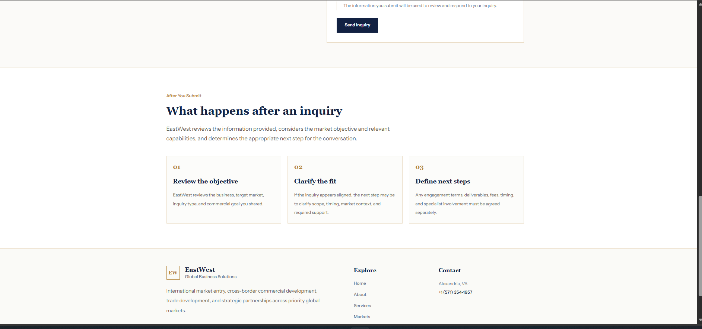

### 12. Mail client manual settings

Mail settings showed the domain being used as IMAP, POP3 and SMTP server. This was useful for the mail/DNS part of the lab.

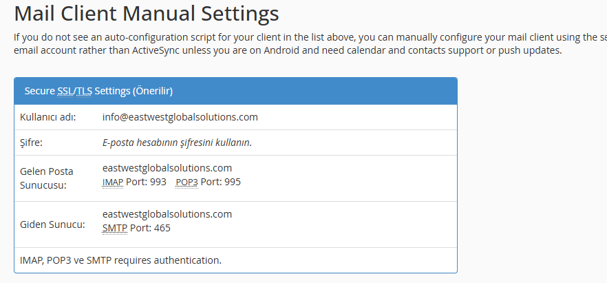

### 13. cPanel email routing

Checked cPanel mail routing. It was set to local/automatic detection. I kept this because it connects with the later DNS warning about missing MX/SPF/DKIM/DMARC.

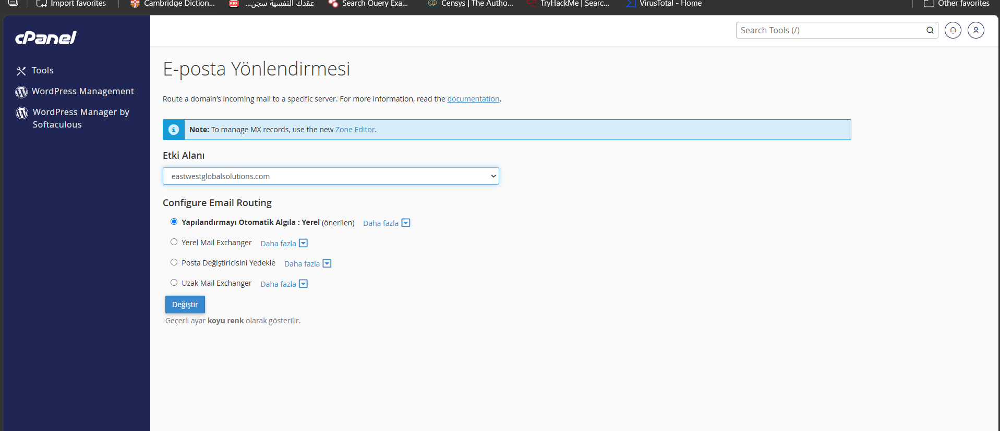

### 14. Cloudflare DNS records

Cloudflare showed only the main A record and the www CNAME. The warning says email cannot reach addresses on the domain and could be spoofed, so MX and SPF/DKIM/DMARC still need work.

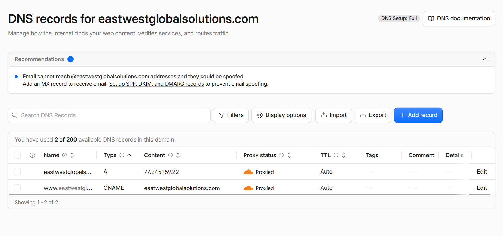

### 15. Cloudflare SSL/TLS mode

SSL/TLS mode was set to Full. This means Cloudflare encrypts browser to Cloudflare and Cloudflare to origin, but the origin certificate side still matters.

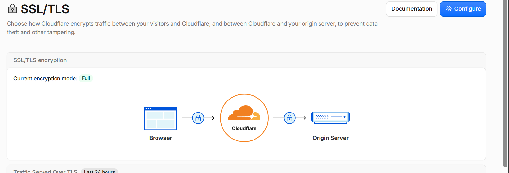

### Notes from this lab

- First verify the hostname and DNS before assuming the site is down.
- Browse the site manually and take notes before running tools.
- Mail setup is not just web hosting. MX, SPF, DKIM and DMARC matter.
- Cloudflare proxying hides some things but DNS/security config still needs checking.

---

## Lab 2 - Security log hunting notes

This lab was about hunting through logs and narrowing down suspicious activity. The main things i followed were network connections, process names, injected threads, LSASS access and command lines.

Some image names say KQL, but part of this was actually Splunk/SPL. I left the names because they were my original working names.

### 1. Finding the source IP and first suspicious processes

Started with Sysmon network events and grouped by destination/source IP, ports and process image. The first interesting row had traffic to `10.0.0.91` from `10.0.0.253`, with processes like `demon.exe`, `randomfile.exe`, `notepad.exe` and `rundll32.exe`.

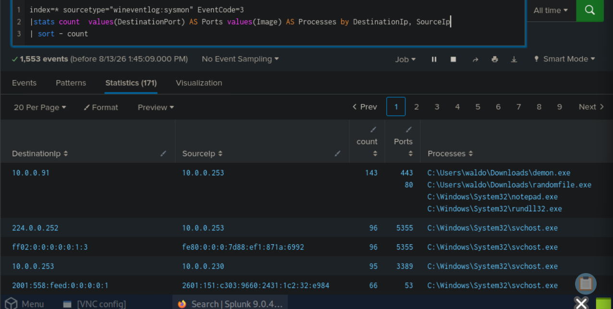

### 2. Narrowing with timing and destination

This query looked at repeated connections and interval behavior. The result made `10.0.0.91` and the process list look more suspicious, especially `rundll32.exe`, `demon.exe`, and `notepad.exe`.

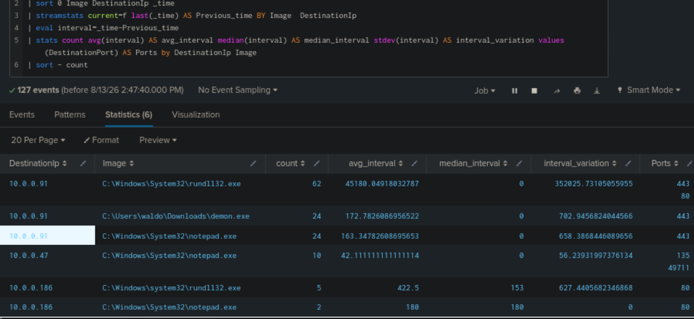

### 3. More complex query attempt

I tried to combine CLR loading and network behavior in one search. It returned zero events, so this was a dead end, but i keep dead ends because they show what i tested.

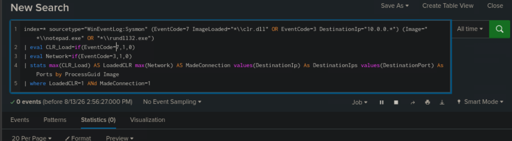

### 4. Checking injected threads

Then i searched Sysmon EventCode 8 for injected threads and compared against average/stdev. `randomfile.exe` stood out here.

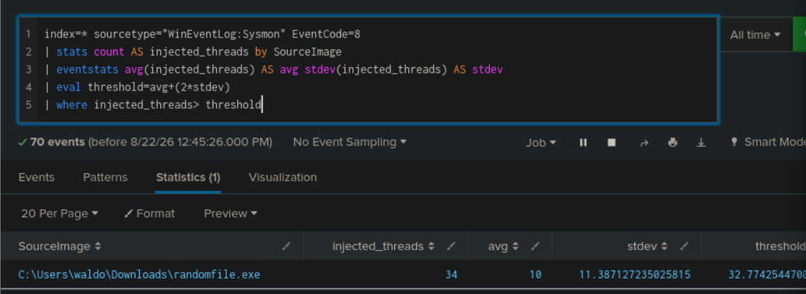

### 5. Finding what spawned rundll32

Pivoted into EventCode 8 again, this time targeting `rundll32.exe`. The source image came back as `C:\Users\waldo\Downloads\randomfile.exe`, which gave me a cleaner chain.

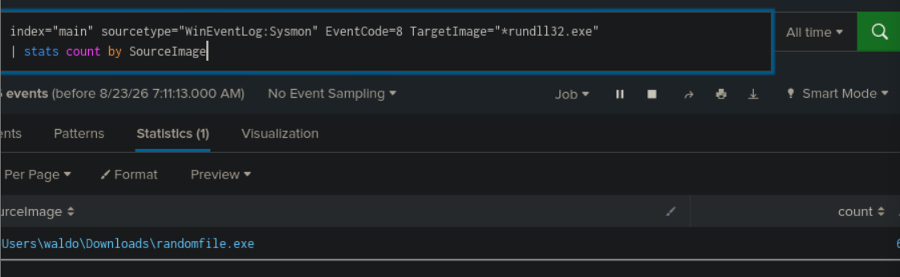

### 6. LSASS access found

Checked LSASS access and saw `notepad.exe`, `Sysmon64.exe`, and `rundll32.exe` touching `lsass.exe` with high access. That is not normal in a clean path.

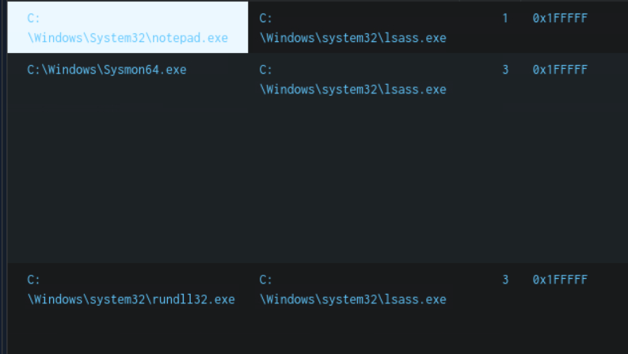

### 7. Narrowing LSASS access more

Used EventCode 10 against `lsass.exe` and filtered out Microsoft .NET source noise. This narrowed the process list further and kept the weird `notepad.exe`/LSASS relationship visible.

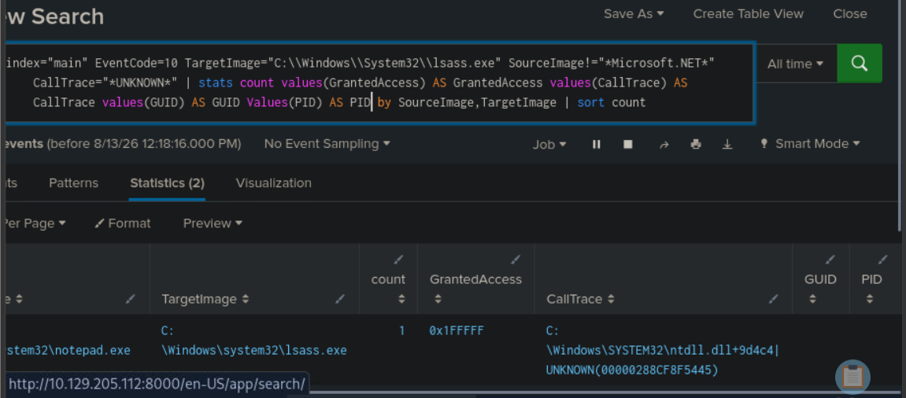

### 8. rundll32 command line showed the dump

The command line showed `rundll32.exe` using `comsvcs.dll MiniDump` to dump LSASS into `C:\temp\lsass.dmp`. This is the big evidence screenshot.

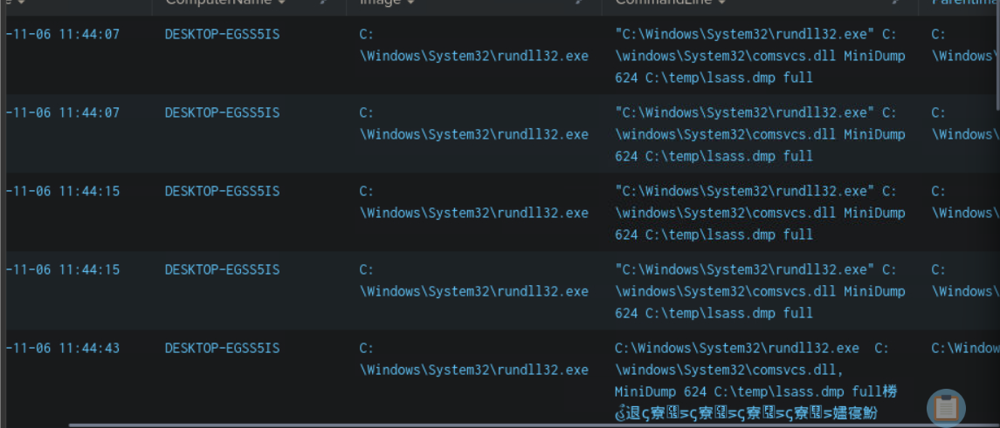

### 9. PsExec command and lab password

Searched for `PsExec` in command lines and found commands using a lab account/password, downloading `comsvcs.dll`, and running commands against hosts. I am not retyping the password here, but it is visible in the lab screenshot.

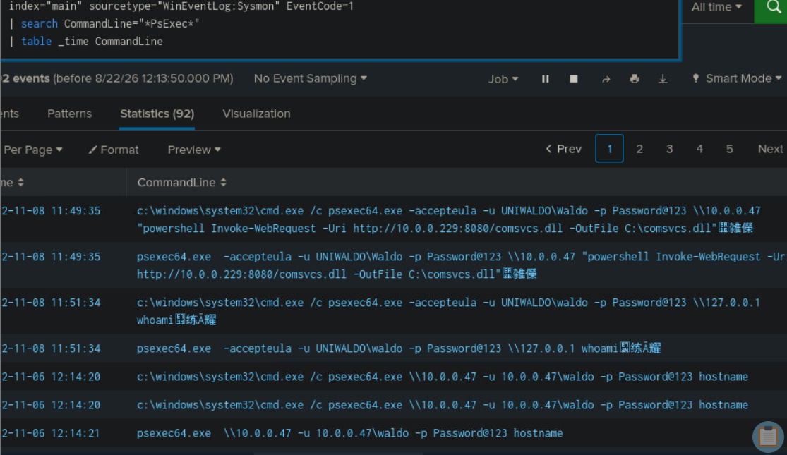

### 10. Event 4624 XML view

Opened the raw XML for Event 4624 to see exact fields instead of only friendly view. Raw XML helps when field names are needed for a query.

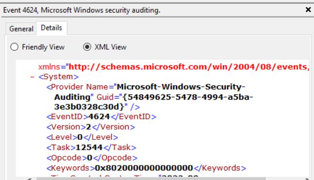

### 11. Elastic filter and event listing

In Elastic Lens i filtered for admin group membership event codes `4732` and `4733`, then narrowed on the administrators group. This was a separate check for user/group change activity.

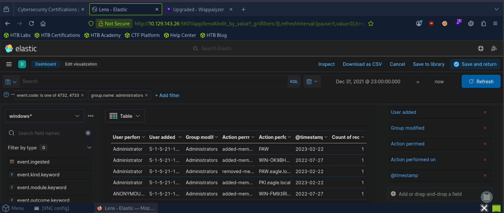

### 12. Better Elastic rows

Added better rows/fields like user, member SID, group and host. Without this the table is harder to read and it is easy to miss the important part.

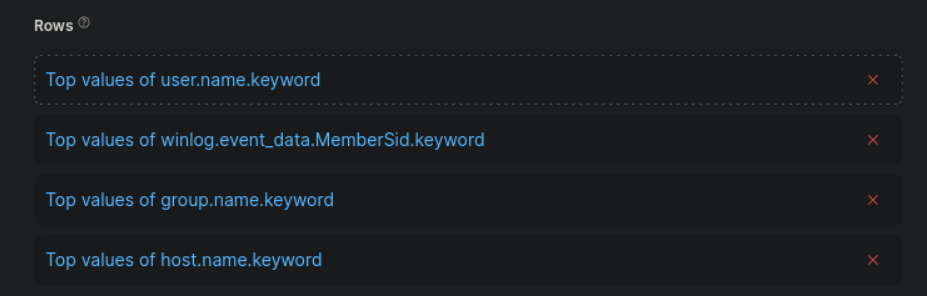

### Notes from this lab

- Start broad, then pivot by IP, process image, target image and command line.
- EventCode 3 helped with network connections.
- EventCode 8 helped with injected thread/source image pivots.
- EventCode 10 helped with LSASS access.
- EventCode 4624 raw XML is useful when friendly view hides the field names.
- The strongest chain here was `randomfile.exe` -> `rundll32.exe` -> `comsvcs.dll MiniDump` -> `lsass.dmp`.
